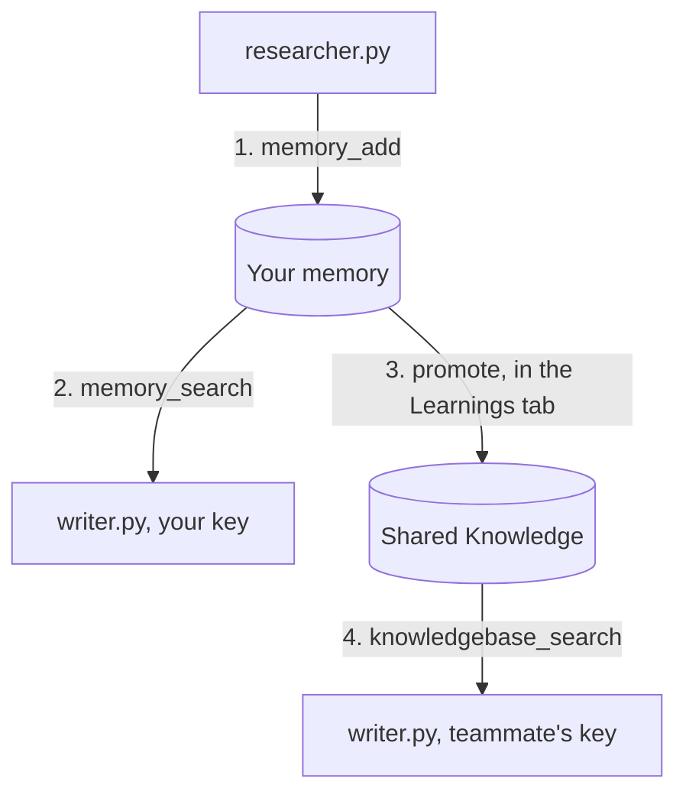

# meko-agent-handoff

Two small Python programs that share what they learn through Meko.

The first, `researcher.py`, asks a model how an HTTP client should retry failed requests and saves each decision it reaches. The second, `writer.py`, starts in a new terminal with nothing in its memory, reads those decisions back, and writes a pull request description from them. Then a person picks which decisions the whole team should see.

This is the code from the webinar "Shared Memory for AI Coding Agents: A Live Build with Meko".

## Words used in this repo

| Word | What it means here |
| --- | --- |
| Agent | A Python script that sends a question to a model and does something with the answer. There is no framework magic here. Each agent is under 50 lines. |
| Meko | The service where decisions are stored. Your code talks to it over MCP, a standard way for a program to call tools on a server. |
| Datapack | Your workspace in Meko. Everything in this repo happens inside one datapack. |
| Memory | A fact an agent saved. Your memories can be read by every agent you run, and each one records which agent wrote it. Nobody else on the datapack can read them. |
| Shared Knowledge | The part of the datapack everyone can read. Files you upload go here, and so do memories you choose to promote. |
| Trace | The record of one run. Every call an agent makes to Meko is listed under it, with what was sent and what came back. |

## What each file does

| File | What it does |
| --- | --- |
| `researcher.py` | Asks the model a question, then saves each decision to Meko with `memory_add`. The model has no Meko tools, so it cannot decide what gets saved. |
| `writer.py` | Reads your memories with `memory_search` and the team's Shared Knowledge with `knowledgebase_search`, then writes a pull request description. If it finds nothing, it stops instead of guessing. |
| `orchestrator.py` | Lets an agent decide what to promote. A rule in code goes first, then a model judges what passed the rule. |
| `promote.py` | Promotes from the terminal, asking you y or n for each memory. |
| `prune.py` | Finds memories that never match the questions your project asks and offers to delete or correct them. |
| `meko.py` | The shared plumbing. Every Meko call goes through one function that attaches your datapack, the agent name, and the trace id. |
| `meko_client.py` | Connects to Meko over MCP and picks the model provider from your `.env`. |

## How a decision travels



Your writer finds the decisions in step 2 because both agents run under your account. A teammate's writer finds nothing until step 3, when you promote the decisions worth sharing. After that their writer finds the promoted ones in Shared Knowledge and still cannot see the rest.

## Set up

You need three things.

| What | Where to get it |
| --- | --- |
| Python 3.13 or later and uv | [uv](https://docs.astral.sh/uv/) installs the dependencies. |
| A Meko account | https://cloud.mekodata.ai. Signing up creates a datapack and an API token. Copy the token, and copy the datapack's ID from the datapack page. |
| A model key you already have | Anthropic, Amazon Bedrock, or Google Vertex AI all work. |

Then:

```bash
git clone git@github.com:YugabyteDB-Samples/meko-agent-handoff.git
cd meko-agent-handoff
uv sync
cp .env.example .env
```

Open `.env` and fill in `MEKO_API_KEY`, `MEKO_DATAPACK_ID`, and your model key. `MODEL_PROVIDER` is `anthropic` by default. Change it to `bedrock` or `vertex` if that is the key you have.

## Run it

Record decisions, then read them back in a second process:

```bash
MEKO_AGENT_ID=researcher:retry-demo uv run researcher.py
MEKO_AGENT_ID=writer:retry-demo uv run writer.py
```

`MEKO_AGENT_ID` is the name each agent saves under. You will see it on every memory the writer prints, which is how you know the researcher wrote them.

Each run prints a trace id. Paste it into the Observe hub for your datapack at cloud.mekodata.ai and you get the run laid out call by call: what the researcher wrote, what the writer searched for, and what each search returned.

## Share with a teammate

Add a second Meko user to the datapack and run the writer with their token:

```bash
ENV_FILE=.env.teammate MEKO_AGENT_ID=writer:retry-demo uv run writer.py
```

Both searches come back empty, because your memories are yours. Open the datapack's Learnings tab in the Meko UI, promote the decisions the team should build on, and run the same command again. Now `knowledgebase_search` returns the promoted decisions, each labeled with the agent that wrote it, and anything you left unpromoted stays private.

Meko also has `context_search`, which searches memory and Shared Knowledge in one call. This sample uses the two direct calls because, when we tested it, `context_search` returned nothing for promoted memories that `knowledgebase_search` found.

## Why the researcher saves with memory_add

Meko has two ways to write, and they do different things.

`conversation_add_message` stores a question and answer pair in the trace, then reads the question side and pulls facts out of it. The answer side is never read. What gets stored is whatever the extractor decides is a fact, in its own words, and it may decide there is nothing.

`memory_add` stores your text as one memory, as written.

The researcher's decisions are in the answer, not the question. If this sample posted the turn, the extractor would read the question, never see the decisions, and save nothing useful. So `record_decision()` calls `memory_add`. The decision is saved every time the loop runs, in the words the model used, and each save shows up in the trace with its text and timing.

If you also want the raw question and answer on record, post the turn with `conversation_add_message` after `record_decision()`. Expect the extractor to add a memory about the question, which changes what the writer prints.

## Let an agent decide what to promote

If you run many agents behind a queue, promotion can be a task an agent picks up instead of a person:

```bash
MEKO_AGENT_ID=orchestrator:retry-demo uv run orchestrator.py
```

It searches your private memories, applies a rule in code first (an open question, or a decision with no reason, is never eligible), lets a model judge what passed the rule, prints a verdict for each memory, and calls `memory_promote` for the approved ones. It runs under its own agent name, so the trace shows which agent promoted what. Promotion needs an owner or maintainer key on the datapack. Add `--rules` to skip the model and promote on the rule alone.

## Change the question

Edit `QUESTION` in `researcher.py` to a decision from your own project. Everything else stays the same.

## The rule

Memory while you and your agents are still working it out. Shared Knowledge when the team should build on it. Your code makes the write, so the record exists after every run.

Questions and what you built go to the Meko Discord.
