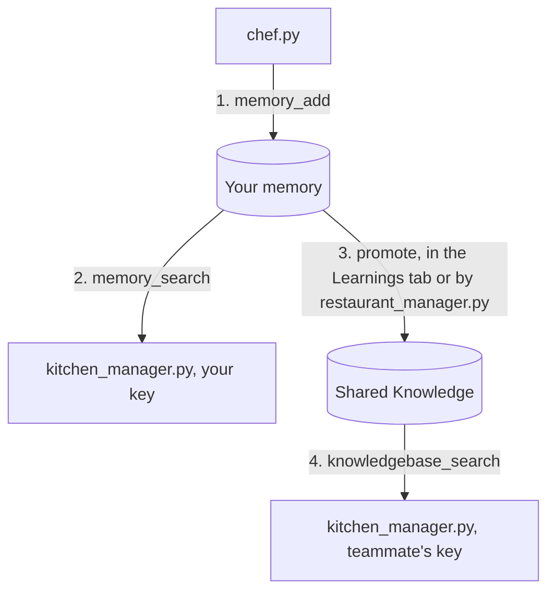

# meko-agent-handoff

Three small Python agents that share what they learn through Meko.

The first, `chef.py`, decides what goes on a bistro's autumn menu and saves each decision it reaches. The second, `kitchen_manager.py`, starts in a new terminal with nothing in its memory, reads those decisions back, and writes the shopping list from them. Then a person, or the third agent, `restaurant_manager.py`, picks which dishes the whole team should see.

The chef is built to call a model, and it will if you give it one. If you do not, it replays a recorded model answer from `chef_example.json`, so the record and recall parts of the demo run with nothing but a Meko key.

This is the code from the webinar "Shared Memory for AI Coding Agents: A Live Build with Meko".

## Words used in this repo

| Word | What it means here |
| --- | --- |
| Agent | A Python script that sends a question to a model and does something with the answer. There is no framework magic here. Each one is a short script you can read top to bottom. |
| Meko | The service where decisions are stored. Your code talks to it over MCP, a standard way for a program to call tools on a server. |
| Datapack | Your workspace in Meko. Everything in this repo happens inside one datapack. |
| Memory | A fact an agent saved. Your memories can be read by every agent you run, and each one records which agent wrote it. Nobody else on the datapack can read them. |
| Shared Knowledge | The part of the datapack everyone can read. Files you upload go here, and so do memories you choose to promote. |
| Trace | The record of one run. Every call an agent makes to Meko is listed under it, with what was sent and what came back. |
| Promote | Move a memory into Shared Knowledge. What that does is authorize the agents of the other Meko user accounts on the datapack to read that record. Only an owner or maintainer can promote, and it goes one way. |

## What each file does

| File | What it does |
| --- | --- |
| `chef.py` | Asks the model what to add to the menu, then saves each finding to Meko with `memory_add`. The model has no Meko tools, so it cannot decide what gets saved. With no `MODEL_PROVIDER` set, it replays the answer in `chef_example.json` instead of calling a model. |
| `chef_example.json` | A recorded model answer to the menu question: three dishes, each with its ingredients, and one open question. The chef replays this when no model is configured. |
| `kitchen_manager.py` | Reads your memories with `memory_search` and the team's Shared Knowledge with `knowledgebase_search`, then writes the shopping list. If it finds nothing, it stops instead of guessing. With no `MODEL_PROVIDER` set, it builds the list from the records themselves, and every line names the agent that recorded it. |
| `restaurant_manager.py` | Lets an agent decide what to promote. A rule in code decides; with `--judge`, a model reviews what passed the rule. |
| `promote.py` | Promotes from the terminal, asking you y or n for each memory. |
| `prune.py` | Finds memories that never match the questions your project asks and offers to delete or correct them. |
| `meko.py` | The shared plumbing. Every Meko call goes through one function that attaches your datapack, the agent name, and the trace id. It also posts each run's question, answer, reasoning, and plan to the trace. |
| `meko_client.py` | Connects to Meko over MCP and picks the model provider from your `.env`. |

## How a decision travels



Your kitchen manager finds the dishes in step 2 because both it and the chef run under your Meko user account. A teammate's kitchen manager finds nothing until step 3, when the decided dishes are promoted. After that, their kitchen manager finds the promoted ones in Shared Knowledge, but only the ones shared. Your other memories stay private.

## Set up

You need three things.

| What | Where to get it |
| --- | --- |
| Python 3.13 or later and uv | [uv](https://docs.astral.sh/uv/) installs the dependencies. |
| A Meko account | https://cloud.mekodata.ai. Signing up creates a datapack and an API token. Copy the token, and copy the datapack's ID from the datapack page. |
| A model key, if you want live answers | Optional. Anthropic, Amazon Bedrock, or Google's Gemini Enterprise Agent Platform (formerly Vertex AI) all work. Without one, the chef replays a recorded answer and the kitchen manager formats the list from the records. |

Then:

```bash
git clone git@github.com:YugabyteDB-Samples/meko-agent-handoff.git
cd meko-agent-handoff
uv sync
cp .env.example .env
```

Open `.env` and fill in `MEKO_API_KEY` and `MEKO_DATAPACK_ID`. That is enough to run the chef and the kitchen manager: with `MODEL_PROVIDER` left empty, the chef replays the recorded answer in `chef_example.json` and writes those records to your datapack, and the kitchen manager builds the shopping list from whatever it recalls.

To have them call a model instead, set `MODEL_PROVIDER` to `anthropic`, `bedrock`, or `vertex` and fill in that provider's lines. `.env.example` shows what each one reads: an API key for Anthropic, a Bedrock API key and region for Bedrock, and Application Default Credentials plus a project for Gemini Enterprise Agent Platform.

## Run it

Record the menu decisions, then read them back in a second process:

```bash
MEKO_AGENT_ID=chef:menu-demo uv run chef.py
MEKO_AGENT_ID=kitchen-manager:menu-demo uv run kitchen_manager.py
```

`MEKO_AGENT_ID` is the name each agent saves under. You will see it on every memory the kitchen manager prints, which is how you know the chef wrote them.

With no model configured, the chef's run prints the same four `recorded:` lines every time, and the trace's "Model answer" entry says the answer was replayed. The kitchen manager's list is then built from the records with no model: a Dishes section with each dish, its reason, the alternative it rejected, and the agent and scope it was recorded under; a To buy section with every ingredient and the dish that needs it; and a section for open questions, which have nothing to buy yet. With a model configured, the kitchen manager hands the same records to the model and prints what it wrote instead.

Each run prints a trace id. Paste it into the Observe hub for your datapack at cloud.mekodata.ai and you get the run laid out call by call: the question the agent was given, the model's answer, why the code did what it did, each search and what it returned, and each memory written.

## Share with a teammate

Add a second Meko user to the datapack. Copy `.env` to `.env.teammate`, replace `MEKO_API_KEY` with that user's token, and keep the same `MEKO_DATAPACK_ID`. Then run the kitchen manager as them:

```bash
ENV_FILE=.env.teammate MEKO_AGENT_ID=kitchen-manager:menu-demo uv run kitchen_manager.py
```

Both searches come back empty, because your memories are yours. Open the datapack's Learnings tab in the Meko UI, promote the dishes the team should build on, and run the same command again. Now `knowledgebase_search` returns the promoted dishes, each labeled with the agent that wrote it, and anything you left unpromoted stays private. Their shopping list covers the promoted dishes under Shared Knowledge and has no open questions section, because the open question was never promoted.

Meko also has `context_search`, which searches memory and Shared Knowledge in one call. This sample uses the two direct calls because, when we tested it, `context_search` returned nothing for promoted memories that `knowledgebase_search` found.

## Why the chef saves with memory_add

Meko has two ways to write, and they do different things.

`conversation_add_message` stores a question and answer pair in the trace, then reads the question side and pulls facts out of it. The answer side is never read. What gets stored is whatever the extractor decides is a fact, in its own words, and it may decide there is nothing.

`memory_add` stores your text as one memory, as written.

The chef's decisions are in the answer, not the question. If this sample posted the turn, the extractor would read the question, never see the dishes, and save nothing useful. So `record_decision()` calls `memory_add`. The decision is saved every time the loop runs, in the words the model used, and each save shows up in the trace with its text and timing.

The sample still posts each run to the trace with `conversation_add_message`, so the question, the answer, the reasoning, and the plan are all there to read later. It puts a short label in the `input` field and the question in `output`, because a question in `input` becomes a memory of its own and shows up in the kitchen manager's search results above the real decisions.

## Let an agent decide what to promote

If you run many agents behind a queue, promotion can be a task an agent picks up instead of a person:

```bash
MEKO_AGENT_ID=restaurant-manager:menu-demo uv run restaurant_manager.py
```

It searches your private memories, applies a rule in code (an open question, a decision with no reason, or a dish with no ingredient list is never eligible), prints a verdict for each memory, and calls `memory_promote` for the approved ones. It runs under its own agent name, so the trace shows which agent promoted what. Promotion needs an owner or maintainer key on the datapack. Add `--judge` to let a model review what passed the rule before it is promoted; the rule in code still runs first and the model cannot override it. `--judge` needs `MODEL_PROVIDER` set.

## Change the question

Edit `QUESTION` in `chef.py` to a decision from your own project, and set `MODEL_PROVIDER` so the chef asks a model. With no model configured it replays `chef_example.json` no matter what `QUESTION` says, because the recorded answer is about the autumn menu. The kitchen manager's `QUERY` and the record format, `DECISION`, `INGREDIENTS`, `REASON`, `REJECTED`, follow the same shape, so change those with it. Everything else stays the same.

## The rule

Memory while you and your agents are still working it out. Shared Knowledge when the team should build on it. Your code makes the write, so the record exists after every run.

## Reset the demo

Every run adds to the datapack: memories from the chef, promotions from the Learnings tab or the restaurant manager, and one conversation per script run in the Observe hub. Promotion is one way, so once a dish is in Shared Knowledge the only way back to an empty datapack is a new datapack.

To start over:

1. Delete the datapack at cloud.mekodata.ai, or call `datapack_delete` from any MCP client connected to Meko. This removes its memories, its Shared Knowledge, and its traces together. If you want to keep the traces from a run, keep that datapack and make a new one instead.
2. Create a new datapack and copy its ID from the datapack page.
3. Put the new ID in `MEKO_DATAPACK_ID` in both `.env` and `.env.teammate`. The tokens do not change.
4. Add the second Meko user to the new datapack again. Membership belongs to the datapack, so it does not carry over.
5. Run the teammate's kitchen manager once. Both searches should return zero. That is your check that the datapack is clean.

If you only want to remove what one run wrote and keep the datapack, `prune.py` deletes or corrects individual memories, and `memory_delete_all` from an MCP client clears every memory at once. Neither undoes a promotion.

If a token appeared on screen during a recording or a shared session, revoke it at cloud.mekodata.ai and create a new one. `.env` and `.env.teammate` are the only places the tokens live in this repo, and both are ignored by git.

Questions and what you built go to the Meko Discord.
