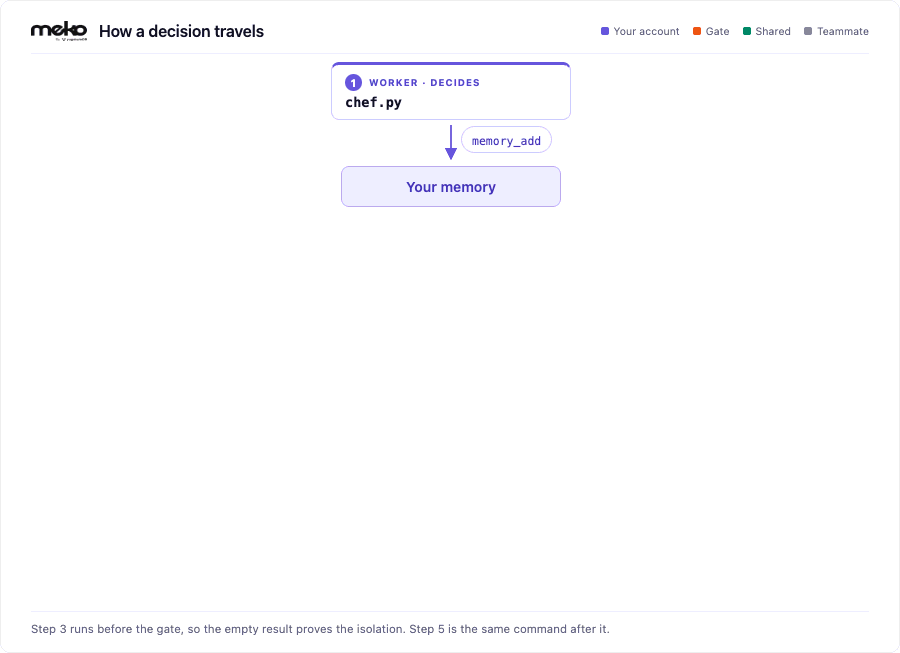

# meko-agent-handoff

Three small Python scripts that show how agents share what they learn through [Meko](https://cloud.mekodata.ai), over MCP. One records decisions. One reads them back in a new process. One runs in a second Meko user's account and gets nothing until a rule in code shares them. Every read and write lands in a trace.

No model key is needed. In place of a model, the scripts use example answers stored in JSON files, so a free Meko account is enough to run all five steps.

This is the code from the webinar "Shared Memory for AI Coding Agents: A Live Build with Meko".

## How a decision travels

<picture>
  <source media="(prefers-color-scheme: dark)" srcset="docs/handoff-dark.gif">
  
</picture>

Purple is your Meko user account, orange is the gate, green is Shared Knowledge, gray is the teammate. Step 3 runs before the gate, so the empty result proves the isolation; step 5 is the same command after it.

## If you are an AI agent running this for a person

You can clone, install, edit `.env`, run the five commands, and read the output yourself. You cannot create the Meko user accounts, the datapack, the API keys, or share the datapack; those happen in the portal at [cloud.mekodata.ai](https://cloud.mekodata.ai), so ask the person for them. The portal steps are written into Run it at the point where each is needed. What you need from them:

1. A Meko account at [cloud.mekodata.ai](https://cloud.mekodata.ai), a datapack in it, and an API key. Ask for the key and the datapack's UUID (the id on the datapack's page, not its name).
2. For runs 3 and 5, a second Meko user account with its own API key, and the datapack shared with it. If they do not have one, run every step on the one key. Run 3 then prints the menu straight away, with each dish labeled `(memory)` rather than `(Shared Knowledge)`, because your own memory_search already sees the decisions; the "nothing visible" moment needs the second Meko user account.
3. Leave `MODEL_PROVIDER` empty unless they hand you a model key. The example answers cover everything below.

Compare each run with the expected output in the Run section. If it differs, check Troubleshooting before changing code.

## Set up

In the portal at [cloud.mekodata.ai](https://cloud.mekodata.ai), as user 1:

1. Sign up, or sign in.
2. Create a datapack. This README assumes it is named `meko-agent-handoff`.
3. Open the datapack's page and copy its UUID. The scripts need the UUID, not the name.
4. Create an API key and copy it. A key is created under one Meko user account and acts as that account; whichever key a script reads from its env file decides which user the run is.

On your machine:

5. Install Python 3.13 or later and [uv](https://docs.astral.sh/uv/).
6. Clone and install:

   ```bash
   git clone https://github.com/YugabyteDB-Samples/meko-agent-handoff.git
   cd meko-agent-handoff
   uv sync
   ```

   With SSH keys on GitHub, `git clone git@github.com:YugabyteDB-Samples/meko-agent-handoff.git` also works.
7. `cp .env.example .env`, then paste the API key into `MEKO_API_KEY` and the UUID into `MEKO_DATAPACK_ID`. Leave `MODEL_PROVIDER` empty.

The demo uses three env files. `.env.example` is the template in the repo. `.env` holds user 1's key and is what the scripts read by default. `.env.teammate` holds user 2's key and is read only when a command sets `ENV_FILE=.env.teammate`; it is created between runs 2 and 3 in Run it, once the second user exists.

Every command sets `MEKO_AGENT_ID`, the name the script writes under. It is required; the scripts stop with a message saying so if it is missing.

## Run it

The demo uses two Meko user accounts on one datapack. A Meko user account is identified by its email address, for example `user_1@example.com`; this README calls the two accounts user 1 and user 2. User 1 runs `chef.py` and `kitchen_manager.py`. User 2 runs `restaurant_manager.py` and can read only what user 1 promotes to Shared Knowledge. Each run prints a `memory` count and a `shared knowledge` count. Those two counts are the result to check.

Start from an empty datapack. To check with one account, open the datapack's Learnings tab in the portal and confirm it lists no memories, or run the command for run 2 and expect `No decided dishes found`. Runs 1, 2 and 4 use user 1's API key in `.env`. Runs 3 and 5 use user 2's key in `.env.teammate`, selected with `ENV_FILE`.

The trace ids and the ids in the promote result shown in the output blocks below are examples. Yours will differ on every run. Match the `memory` and `shared knowledge` counts and the message text.

### 1. The chef records the menu decisions

`chef.py` runs in Meko user 1's account, using the API key in `.env`. It asks the model for three decided dishes and one open question, then writes each finding to user 1's memory with `memory_add`. The model has no Meko tools. The write happens in code on every run. Expected output: a trace id and four `recorded:` lines.

```bash
MEKO_AGENT_ID=chef:menu-demo uv run chef.py
```

> **Expected output**
>
> `trace: 1f9c2d4e6b8a4c0e9d3b7a5f2e1c8b6d`<br>
> `recorded: DECISION: Roasted squash soup as the starter on the autumn menu. REASON: Squash`<br>
> `recorded: DECISION: Mushroom and leek pie as the vegetarian main on the autumn menu. REASO`<br>
> `recorded: DECISION: Pear and almond tart as the dessert on the autumn menu. REASON: Pears`<br>
> `recorded: OPEN_QUESTION: Should the roast chicken stay on the autumn menu, or come off to`

With `MODEL_PROVIDER` empty, the answer comes from `chef_example.json`, so the four lines are identical on every run.

### 2. The kitchen manager adds the shopping notes

`kitchen_manager.py` is a separate process and shares no state with `chef.py`. It runs in the same Meko user account as the chef, user 1, using the same API key in `.env`, so `memory_search` returns the chef's four records and `knowledgebase_search` returns nothing. It keeps the three `DECISION` records, looks up each dish's ingredients in `kitchen_manager_example.json`, and writes one `INGREDIENTS` record per dish with `memory_add` under its own agent id. Expected output: `memory: 4 results` with each row tagged `[chef:menu-demo]`, `shared knowledge: 0 results`, then three `recorded:` lines and the shopping list.

```bash
MEKO_AGENT_ID=kitchen-manager:menu-demo uv run kitchen_manager.py
```

> **Expected output**
>
> `trace: 3a7e5c1b9d2f4a6c8e0b1d3f5a7c9e2b`<br>
> `memory: 4 results`<br>
> `  [chef:menu-demo] DECISION: Roasted squash soup as the starter on the autumn menu. REASON: Squash is at its`<br>
> `  [chef:menu-demo] OPEN_QUESTION: Should the roast chicken stay on the autumn menu, or come off to make room`<br>
> `  [chef:menu-demo] DECISION: Pear and almond tart as the dessert on the autumn menu. REASON: Pears arrive in`<br>
> `  [chef:menu-demo] DECISION: Mushroom and leek pie as the vegetarian main on the autumn menu. REASON: The kit`<br>
> `shared knowledge: 0 results`<br>
> `recorded: INGREDIENTS: Roasted squash soup as the starter on the autumn menu. NEEDS: butte`<br>
> `recorded: INGREDIENTS: Mushroom and leek pie as the vegetarian main on the autumn menu. NE`<br>
> `recorded: INGREDIENTS: Pear and almond tart as the dessert on the autumn menu. NEEDS: pear`<br>
>
> `# To buy for the autumn menu`<br>
>
> `- butter (for: Pear and almond tart as the dessert on the autumn menu)`<br>
> `- butternut squash (for: Roasted squash soup as the starter on the autumn menu)`<br>
> `- ground almonds (for: Pear and almond tart as the dessert on the autumn menu)`<br>
> `- leeks (for: Mushroom and leek pie as the vegetarian main on the autumn menu)`<br>
> `- mushrooms (for: Mushroom and leek pie as the vegetarian main on the autumn menu)`<br>
> `- onion (for: Roasted squash soup as the starter on the autumn menu)`<br>
> `- pears (for: Pear and almond tart as the dessert on the autumn menu)`<br>
> `- puff pastry (for: Mushroom and leek pie as the vegetarian main on the autumn menu)`<br>
> `- vegetable stock (for: Roasted squash soup as the starter on the autumn menu)`

Memory is scoped to the Meko user account, not to the agent. The `agent_id` on each row identifies the writer. Search results are ranked by relevance score, so row order can vary between runs.

### 3. The restaurant manager finds nothing

Before this run, in the portal at [cloud.mekodata.ai](https://cloud.mekodata.ai):

1. As user 1, open the datapack and share it with user 2's email address.
2. Sign out, then sign in as user 2. Accept the share if the portal asks.
3. As user 2, create an API key and copy it.

Then on your machine, `cp .env .env.teammate` and replace `MEKO_API_KEY` with user 2's key. Keep `MEKO_DATAPACK_ID` the same. Skip any of these and run 3 fails: without the share, user 2 cannot see the datapack; without user 2's key in `.env.teammate`, the run is still user 1 and prints the menu instead of the not-ready message.

`restaurant_manager.py` runs in Meko user 2's account, using the API key in `.env.teammate`, and makes the same two searches. Memory in Meko is private to the user account that wrote it, so user 2 cannot read user 1's memory, and nothing has been promoted, so both searches return zero results. The script reports that the menu is not ready and exits without writing. Expected output: `memory: 0 results` and `shared knowledge: 0 results`, then the not-ready message.

```bash
ENV_FILE=.env.teammate MEKO_AGENT_ID=restaurant-manager:menu-demo uv run restaurant_manager.py
```

> **Expected output**
>
> `trace: 8512e829a5a2471b98dca7b66312ce64`<br>
> `memory: 0 results`<br>
> `shared knowledge: 0 results`<br>
>
> `The menu is not ready yet. Nothing has been shared with the team.`

Seven records exist on the datapack. None is visible to user 2.

### 4. The chef promotes the decided dishes

`chef.py --promote` runs in Meko user 1's account again, using the key in `.env`. It searches user 1's memory and applies `allowed_by_policy()` to each record: a `DECISION` with a `REASON` is promoted; an `OPEN_QUESTION` is not; `INGREDIENTS` records are not, because they are not menu items. It then calls `memory_promote` with the three approved ids. Expected output: seven verdicts, then the promote result with three ids.

```bash
MEKO_AGENT_ID=chef:menu-demo uv run chef.py --promote
```

> **Expected output**
>
> `trace: 5c76bfe78e0d400686e9e2080cdb2b9a`<br>
> `PROMOTE DECISION: Roasted squash soup as the starter on the autumn menu. REASO`<br>
> `         decided, with a reason`<br>
> `KEEP    OPEN_QUESTION: Should the roast chicken stay on the autumn menu, or co`<br>
> `         open questions stay private until settled`<br>
> `PROMOTE DECISION: Pear and almond tart as the dessert on the autumn menu. REAS`<br>
> `         decided, with a reason`<br>
> `PROMOTE DECISION: Mushroom and leek pie as the vegetarian main on the autumn m`<br>
> `         decided, with a reason`<br>
> `KEEP    INGREDIENTS: Roasted squash soup as the starter on the autumn menu. NE`<br>
> `         only decided dishes go on the menu`<br>
> `KEEP    INGREDIENTS: Mushroom and leek pie as the vegetarian main on the autum`<br>
> `         only decided dishes go on the menu`<br>
> `KEEP    INGREDIENTS: Pear and almond tart as the dessert on the autumn menu. N`<br>
> `         only decided dishes go on the menu`<br>
> `{'inserted_ids': ['b68312c8-...', 'b6e38db7-...', 'c41d9a02-...'], 'updated_ids': [], 'not_found_ids': []}`

The rule is code. It runs in Meko user 1's account with the agent id `chef:menu-demo`, so the trace records which agent promoted which ids.

### 5. The restaurant manager prints the menu

Same command as run 3, in Meko user 2's account with the key in `.env.teammate`. `knowledgebase_search` now returns the three promoted records, each tagged `chef:menu-demo`, and the script prints the menu. Expected output: `memory: 0 results` and `shared knowledge: 3 results`, then the menu.

```bash
ENV_FILE=.env.teammate MEKO_AGENT_ID=restaurant-manager:menu-demo uv run restaurant_manager.py
```

> **Expected output**
>
> `trace: 0e83b3330120469d8a9aa44ed88670cf`<br>
> `memory: 0 results`<br>
> `shared knowledge: 3 results`<br>
> `  [chef:menu-demo] DECISION: Roasted squash soup as the starter on the autumn menu. REASON: Squash is at its`<br>
> `  [chef:menu-demo] DECISION: Pear and almond tart as the dessert on the autumn menu. REASON: Pears arrive in`<br>
> `  [chef:menu-demo] DECISION: Mushroom and leek pie as the vegetarian main on the autumn menu. REASON: The kit`<br>
>
> `# Autumn menu`<br>
>
> `3 dishes decided by the kitchen.`<br>
>
> `- Roasted squash soup as the starter on the autumn menu.`<br>
> `  Decided by: chef:menu-demo (Shared Knowledge)`<br>
> `- Mushroom and leek pie as the vegetarian main on the autumn menu.`<br>
> `  Decided by: chef:menu-demo (Shared Knowledge)`<br>
> `- Pear and almond tart as the dessert on the autumn menu.`<br>
> `  Decided by: chef:menu-demo (Shared Knowledge)`

The `OPEN_QUESTION` and `INGREDIENTS` records were not promoted and remain invisible to user 2.

### Read the traces

Each run prints a trace id on its first line. In the portal at [cloud.mekodata.ai](https://cloud.mekodata.ai), open the datapack, open the Observe hub, and paste the trace id. The run is laid out call by call: the question, the model answer, the reasoning, each search with its results, and each write. Open the run 3 trace first. It records two empty searches with a timestamp, which is the evidence that user 2 did not have the decisions at that time.

### Two more scripts

`promote.py` is the person-in-the-loop version of run 4. It searches user 1's memory and asks y or n for each record before calling `memory_promote`.

```bash
MEKO_AGENT_ID=promote:menu-demo uv run promote.py
```

`prune.py` finds memories that never match the questions this project asks and offers to delete or correct each one.

```bash
MEKO_AGENT_ID=prune:menu-demo uv run prune.py
```

## The cast

The scripts use a restaurant story so the flow reads without knowing the code. Each one stands in for a role you would find in an agent system.

| Script | Story role | Agent role | Meko calls |
| --- | --- | --- | --- |
| `chef.py` | Head chef decides the menu | A worker agent that makes decisions (your coding agent, a research agent) | `memory_add`, four records, under `chef:menu-demo` |
| `kitchen_manager.py` | Kitchen manager works out what to buy | A second worker under the same Meko user account that consumes those decisions (planner, executor) | `memory_search`, `knowledgebase_search`, then `memory_add`, three records, under its own agent_id |
| `chef.py --promote` | The chef publishes the decided dishes | An orchestrator or governance policy that decides what becomes team knowledge | `memory_search`, a rule in code, `memory_promote` |
| `restaurant_manager.py` | Restaurant manager prints the menu | A consumer under another Meko user account (a reviewer agent, a teammate's agent) | both searches; stops if nothing is visible |
| `promote.py` | A person chooses dishes to publish | Human-in-the-loop review | `memory_promote`, one y/n per memory |
| `prune.py` | Clearing the pantry | Memory hygiene | `memory_delete_by_id`, `memory_update` |
| Observe hub (UI) | The kitchen log | Observability | every call, under one trace id per run |

The words: a **datapack** is the workspace. A **memory** belongs to your Meko user account; every agent you run can read it, and each row keeps the agent_id that wrote it. **Shared Knowledge** is the datapack's; everyone it is shared with can read it. **Promote** moves a memory into Shared Knowledge, one way, and needs an owner or maintainer key. A **trace** is the record of one run.

## What it demonstrates

**The code decides what is persisted.** Meko has two ways to write. `conversation_add_message` stores a turn in the trace and extracts memories from its input side only; the extractor rewrites what it reads and may keep nothing. `memory_add` stores your text as one memory, as written. The decisions live in the model's answer, so `record_decision()` writes them with `memory_add`; the model never touches Meko. The scripts still post each run to the trace with `conversation_add_message`, with a short label in `input` and the question in `output`, because a question in `input` becomes a memory of its own and outranks the real decisions in search.

**Memory is per Meko user account, labeled by agent.** Step 2 reads step 1's records because both run in Meko user 1's account; the agent_id on each row is a label, not a wall. Step 3 reads nothing because it runs in Meko user 2's account.

**Promotion is the gate, and it can be code.** Nothing becomes team knowledge until something promotes it: a rule in `chef.py --promote`, a person in `promote.py`, or a click in the Learnings tab. It goes one way.

**Every call is traced.** `meko.py` routes each call through one function that attaches the datapack, the agent_id, and the trace id.

## Use a model instead of the example answers

Set `MODEL_PROVIDER` in `.env` to `anthropic`, `bedrock`, or `vertex` and fill in that provider's lines; `.env.example` lists them (an API key for Anthropic, a Bedrock API key and region, Application Default Credentials and a project for Gemini Enterprise Agent Platform, formerly Vertex AI). Then change `QUESTION` in `chef.py` to a decision from your own project and `QUERY` in all three scripts to describe what to recall. With no model, `chef.py` uses the example answer in `chef_example.json` whatever `QUESTION` says, and `kitchen_manager.py` only knows the dishes in `kitchen_manager_example.json`.

## Troubleshooting

- `MEKO_AGENT_ID is not set`: the command was run without the `MEKO_AGENT_ID=...` prefix.
- `MEKO_DATAPACK_ID is ... not a datapack id`: you pasted the datapack's name. It needs the UUID from the datapack's page.
- Step 3 shows rows: the datapack is not empty. Start over, below.
- Step 4 fails on `memory_promote`: your key is not an owner or maintainer on the datapack.
- Step 4 prints `nothing promoted`: the policy approved nothing, which means step 1 did not run against this datapack.
- Step 5 shows `shared knowledge: 0 results`: step 4 did not run on your key, or the teammate is not on the datapack.

## Start over

Promotion is one way, so an empty datapack means a new datapack. In the portal at [cloud.mekodata.ai](https://cloud.mekodata.ai), as user 1, create a new datapack and copy its UUID, then share it with user 2's email address again; membership belongs to the datapack and does not carry over. Put the new UUID in `MEKO_DATAPACK_ID` in both `.env` and `.env.teammate`; the API keys do not change. Then run the run 3 command once: `memory: 0 results` and `shared knowledge: 0 results` means it is clean. With one account, run the run 2 command instead and expect `No decided dishes found`. To remove single memories and keep the datapack, use `prune.py`. If a key appeared on screen, revoke it in the dashboard and create a new one; `.env` and `.env.teammate` are git-ignored.

Questions and what you built go to the [Meko Discord](https://discord.gg/yugabyte).
