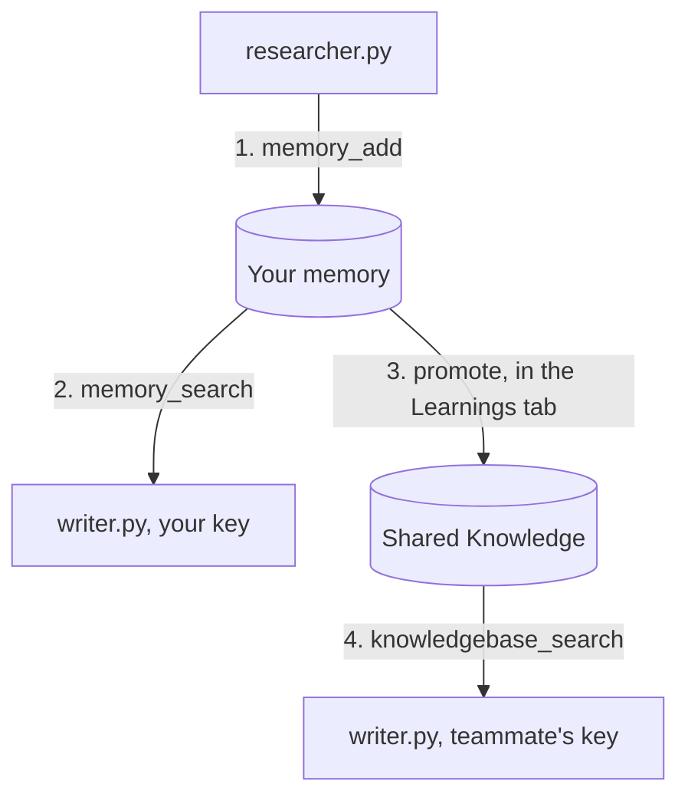

# meko-agent-handoff

Two Python agents on the [Strands Agents SDK](https://strandsagents.com) sharing decisions through [Meko](https://mekodata.ai). One agent researches a question and records what it decided and why. A second agent, in a fresh process with no prior context, reads those decisions back. A person promotes the ones the team should build on. Afterwards you can open the run in Meko and see what each agent wrote, what it searched for, and what came back.

This is the code from the webinar "Shared Memory for AI Coding Agents: A Live Build with Meko" (September 22, 2026).

## What each file does

| File | Role |
| --- | --- |
| `meko.py` | The plumbing. Every Meko call goes through `call()`, which attaches the datapack, the `agent_id`, and the trace id. |
| `researcher.py` | Agent 1. Asks a model how `http_client.py` should retry, then plain Python writes each decision with `memory_add`. The agent has no Meko tools attached. |
| `writer.py` | Agent 2. New process, no local state. Reads your memories with `memory_search` and the team's Shared Knowledge with `knowledgebase_search`, then writes a pull request description. Stops if both come back empty. |
| `promote.py` | The orchestrator-agent shape of promotion: code that holds `memory_promote` and asks before each call. In the webinar, promotion happens in the Meko UI instead. |
| `orchestrator.py` | Agent-decided promotion. Code sets the guardrail (only a DECISION with a REASON is eligible, never an OPEN_QUESTION), a model judges inside it, and `memory_promote` runs under its own `agent_id` so the trace shows who made the call. `--rules` skips the model. |
| `prune.py` | Cleanup with a person in the loop. Runs the project's questions, flags memories that never score above a floor, and offers delete or correct. |
| `meko_client.py` | The Strands `MCPClient` wiring and the model provider setup, unchanged from [meko-agent-strands-sample](https://github.com/YugabyteDB-Samples/meko-agent-strands-sample). |

## How the pieces connect



The writer asks both scopes and prints which one answered. Before step 3, the teammate's writer gets nothing from either. After it, `knowledgebase_search` returns the promoted records and nothing else, and the promoted memories leave your private memory.

## Why the researcher calls memory_add and not conversation_add_message

Meko has two write paths, and they do different things. Read from `src/tools.py` in the MCP server on September 21, 2026:

| Call | What the server does with your text | Who decides what is stored |
| --- | --- | --- |
| `conversation_add_message(input, output)` | Stores the turn word for word in the conversation trace. Then runs mem0 extraction with `infer=True` over the `input` side only, and only if the turn is substantive. The `output` is never passed to the extractor. | The extractor. It rewrites the user's words into facts it thinks are durable, and it may return nothing. |
| `memory_add(text)` | Calls mem0 with `infer=False`. One memory row, your text as written, plus entity links for search. | Your code. |

The researcher's decisions are on the output side of its turn: the question goes in, the decisions come out. If the demo posted that turn with `conversation_add_message`, the extractor would read the question, not the answer, and the decisions would never become memories. The September 15 proof run on production showed exactly that: a decision that lived only in the assistant output produced no extracted memory, and only the explicit `memory_add` record was searchable.

So `record_decision()` calls `memory_add`, and three things follow:

1. The text is persisted as written. `infer=False` skips the rewrite, so the reason and the rejected alternative survive as the agent stated them.
2. The write happens on every run, because it is a line in the loop, not a tool the model may or may not call.
3. Each call shows up on its own in the run's trace, with the text it wrote and how long it took, so you can audit the three writes later.

`conversation_add_message` is still the right call for a transcript. If you want the researcher's raw question and answer on record as well, post the turn after `record_decision()`. Be aware that extraction will then run on the question and may add a derived memory such as "user asked how http_client.py should retry," which changes the result counts in `writer.py`.

## The three scopes this demo uses

- A conversation is the ordered record of one run. Its id is also the trace id.
- A memory is a fact an agent stored. Memories belong to you, every agent you run can read them, and each row keeps the `agent_id` that wrote it.
- Shared Knowledge belongs to the datapack, the workspace your team shares. It holds uploaded documents and memories a person promoted.

## Prerequisites

1. Python 3.13 or later and [uv](https://docs.astral.sh/uv/).
2. A Meko account at https://cloud.mekodata.ai. A default datapack and an API token are created on signup. Copy the token and the datapack UUID (the ID field on the datapack page).
3. A model key you already own. `MODEL_PROVIDER` accepts `anthropic`, `bedrock`, or `vertex` (Vertex uses `gcloud auth application-default login`, no key).

## Run it

```bash
git clone git@github.com:YugabyteDB-Samples/meko-agent-handoff.git
cd meko-agent-handoff
uv sync
cp .env.example .env   # fill in MEKO_API_KEY, MEKO_DATAPACK_ID, and a model key
```

Record decisions, then recall them in a second process:

```bash
MEKO_AGENT_ID=researcher:retry-demo uv run researcher.py
MEKO_AGENT_ID=writer:retry-demo uv run writer.py
```

Each run prints a trace id. Paste it into the Observe hub of your datapack at cloud.mekodata.ai and you get the run laid out call by call: what the researcher wrote, what the writer searched for, and what each search returned.

## Share with a teammate

Add a second Meko user to the datapack and run the writer with their token:

```bash
ENV_FILE=.env.teammate MEKO_AGENT_ID=writer:retry-demo uv run writer.py
```

Both searches come back empty, because your memories are yours. Open the datapack's Learnings tab, promote the decisions the team should build on, and run the same command again. `knowledgebase_search` now returns the promoted records, each labeled with the agent that wrote it, and anything you left unpromoted stays private.

Meko also has `context_search`, which queries memory, Shared Knowledge, and conversation history in one call. As of September 21, 2026 its Shared Knowledge list applied a stricter distance cutoff than `knowledgebase_search` and returned nothing for promoted memories that the direct call found, so this sample uses the direct calls.

## Let an agent decide what to promote

If you run a fleet of agents behind a queue, promotion is a task an orchestrator can pick up instead of a person. `orchestrator.py` is that shape:

```bash
MEKO_AGENT_ID=orchestrator:retry-demo uv run orchestrator.py
```

It searches the private memories, applies a policy in code first (an open question or a decision without a reason is never eligible), lets a model judge what passed the policy, prints a verdict and a reason for each record, and calls `memory_promote` for the approved ids. The call runs under the orchestrator's `agent_id`, so the Observe hub shows which agent promoted what. Promotion still requires owner or maintainer permission on the datapack, so the orchestrator runs with a key that has it. Pass `--rules` to promote on the policy alone with no model call.

## Change the question

Edit `QUESTION` in `researcher.py` to a decision from your own project. Everything else stays the same.

## The rule

Memory while you and your agents are still working it out. Shared Knowledge when the team should build on it. Your code makes the write, so the record exists after every run.

Questions and what you built go to the Meko Discord.
